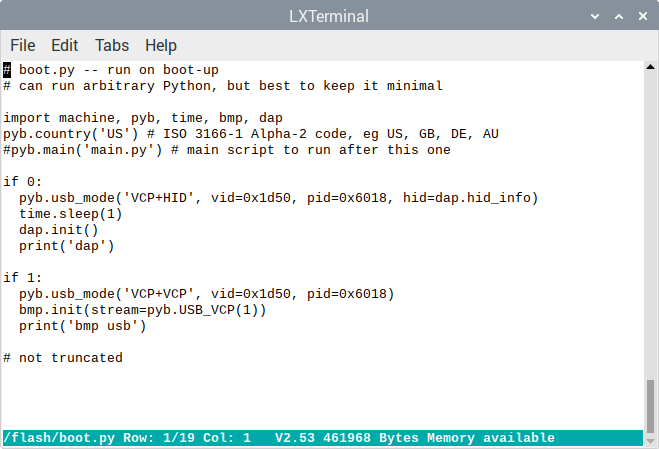

# bmp

This is firmware and sources for a debugger probe that targets arm processors. The debugger probe has

-   built-in gdb server, to debug using gdb 
-   built-in cmsis-dap probe, to debug using [openocd](http://openocd.org/) and [pyocd](https://github.com/pyocd/pyOCD)
-   built-in micropython with extensions: 
    -   read and write target ram, flash and registers
    -   set and clear target breakpoints and watchpoints

... all without changing connectors

## Download

[Precompiled binaries](https://github.com/koendv/bmp/releases) for ST-Link V3 mini, PYBD_SF2, DEVEBOX_STM32H743, DEVEBOX_STM32H750, and ESP32-WROVER.

## Flashing firmware

These are generic instructions for downloading firmware to an stm32 or esp32 board.
If the board has specific download instructions, follow those instructions instead.

### stm32

#### Install

If the board has a *boot0* button, keep the *boot0* button pressed during board reset or power up to enter dfu mode. If the board has a *boot0* pin, connect the *boot0* pin high (3.3V), and power up or reset the board to enter dfu mode. 

Once the board is in dfu mode, download bootloader and application firmware with `dfu-util`. For example, if the board is a *DEVEBOX_STM32H743*, bootloader firmware will be in directory mboot/build-DEVEBOX_STM32H743, and application firmware will be in directory build-DEVEBOX_STM32H743:

    dfu-util -a 0 -d 0x0483:0xDF11 -D mboot/build-DEVEBOX_STM32H743/firmware.dfu
    dfu-util -a 0 -d 0x0483:0xDF11 -D build-DEVEBOX_STM32H743/firmware.dfu

Alternatively, connect a debugger to the SWD port and download the firmware that way. If the debugger fails to connect, configure *assert SRST during attach*.

#### Upgrade

If the board already runs micropython, enter dfu mode by typing at the micropython prompt:

    >>> machine.bootloader()

and download the application firmware using `dfu-util`. You can only upgrade the application this way, not the bootloader.

### esp32

Install [esptool](https://github.com/espressif/esptool) and download over usb:

    esptool.py --chip esp32 --port /dev/ttyUSB0 --baud 460800 write_flash -z --flash_mode dio --flash_freq 40m 0x1000 build-ESP32_WROVER/firmware.bin

## Usage

This section explains how to use the gdb server, the CMSIS-DAP probe, and the micropython extension modules.

## Black Magic Probe

Black Magic Probe implements a gdb server. 
The connection with the gdb server can be over usb, serial port, or network interface.

### usb

To connect to gdb using a usb virtual comm port, the `boot.py` file in the micropython internal file system should be similar to this:

    if 1:
      pyb.usb_mode('VCP+VCP', vid=0x1d50, pid=0x6018)
      bmp.init(stream=pyb.USB_VCP(1))
      print('bmp usb')

You can edit `boot.py` by typing at the micropython prompt 

    >>> pye('/flash/boot.py')

Saving is ctrl-S; exiting is ctrl-Q.
Restart micropython with `machine.reset()`.
Next, on the host:

    $ arm-none-eabi-gdb -q
    (gdb) target extended-remote /dev/ttyACM1
    Remote debugging using /dev/ttyACM1
    (gdb) monitor swdp_scan
    Available Targets:
    No. Att Driver
     1      STM32F1 (clone) medium density M3
    (gdb) attach 1
    Attaching to Remote target

and begin debugging.

### serial

To connect using a serial port, in `boot.py`:

    bmp.init(stream=machine.UART(1,115200))

and on the host:

    (gdb) target extended-remote /dev/ttyS0

if the debugger is connecte to host serial port ttyS0.

### tcp

To connect using tcp, in `main.py` put:

    import network
    def wifi_on():
        import network
        wlan = network.WLAN(network.STA_IF)
        wlan.active(True)
        if not wlan.isconnected():
            print('connecting...')
            wlan.connect('essid', 'passwd')
            while not wlan.isconnected():
                pass
        print(wlan.ifconfig())
        
    wifi_on()
    bmp.init(tcp=3333)

and on the host:

    (gdb) target extended-remote 192.168.0.16:3333

where you have to replace 192.168.0.16 with the ip address of the probe.

In general, micropython stream devices - usb, serial, bluetooth - and ip network interfaces ought to work. You could connect a gsm mobile phone module to a micropython serial port and make your debugger mobile, for instance. Or use wifi to debug your drone while it's flying.

## Free-DAP

The debugger includes Free-DAP, a CMSIS-DAP probe. Free-DAP only supports SWD, not JTAG.

### Setup

The DAP probe is a usb HID device and is only available on stm32, not on esp32. (The esp32 port has no native usb). You cannot run both dap and bmp at the same time.

To use dap, first you need to configure micropython as a usb HID device, then start the dap module. To configure micropython as a dap probe, enable the following lines in `boot.py`:

    if 1:
      pyb.usb_mode('VCP+HID', vid=0x1d50, pid=0x6018, hid=dap.hid_info)
      time.sleep(1)
      dap.init()
      print('dap')

and disable the bmp module (`if 0:`).
Restart micropython with `machine.reset()`. Now you can connect openocd to the DAP probe:

    $ openocd -f interface/cmsis-dap.cfg -f target/stm32f1x.cfg

and in another window you can connect gdb to openocd:

    $ arm-none-eabi-gdb -q -nh
    (gdb) target extended-remote localhost:3333

and begin debugging. 

The default SWD clock frequency is 1MHz. This frequency can probably be increased. 

### Clock frequency calibration

With the default calibration values, SWD clock frequency ought to have an accuracy of better than 1%. 

For increased accuracy, the SWD clock frequency can be calibrated. At the micropython command prompt, type *dap.calibrate()*

Calibration takes 20 seconds. Calibration output is a tuple of two numbers, e.g.:

    >>> dap.calibrate()
    (35985, 8999685)

Calibration data are lost when micropython reboots, but there is no need to re-run calibration every time micropython boots. 
Once you know the calibration data of your board, you can simply set calibration values in `main.py`, e.g.:

    dap.calibrate(cal=(35985, 8999685))

### Clock frequency measurement

The calibration tuple consists of two numbers: 

-   the first number is the number of delay loops that is needed to produce a clock of 1 kHz
-   the second number is the clock frequency that results from using no (0) delay loops.

These two numbers may differ between boards,  micropython versions and compilation runs.

To measure clock frequency using a frequency meter or an oscilloscope, it is possible to output a fixed clock on the SWCLK pin. Simply call calibrate(), with the number of delay cycles wanted. E.g. on the above board, 

    >>> dap.calibrate(delay=35985)

gives a 1kHz square wave, and 

    >>> dap.calibrate(delay=0)

gives a 9 MHz square wave. A call to dap.calibrate(delay=*number*) does not return; type ctrl-c when you are done measuring.

If you attach an oscilloscope to the SWCLK pin  while dap.calibrate() is running, you will see the clock frequency converging from  9 MHz to 1 kHz.

## Semihosting

The debugger supports semihosting. Semihosting print output is to the micropython console, and semihosting keyboard input  is from the micropython console. Semihosting file i/o is to the micropython file system. If you plan on writing large files, choose a debugger board with a micro-sd card.

Semihosting calls run in the debugger probe itself. Some semihosting calls are implemented in micropython. Should you wish to customize these system calls, edit `extmod/blackmagic/modules/common/semihosting.py`.

Semihosting is initialized by putting `semihosting.init()` in `main.py`.

## traceswo

The debugger decodes Serial Wire Output (SWO) output.

As an example, assume target sends an SWO stream at 2250000 baud.

### stm32

On debuggers with an stm32 processor, with target SWO connected to debugger uart2 rx:

    swo_uart=machine.UART(2,2250000)
    bmp.traceswo(uart=swo_uart)

### esp32

On debuggers with a ESP32-WROVER processor, with target SWO connected to ESP32 pin 22:

    swo_uart=machine.UART(1,2250000,rx=22,tx=23)
    bmp.traceswo(uart=swo_uart)

### traceswo channels

If only interested in SWO channels 1 and 2:

    bmp.traceswo(uart=swo_uart,chan=[1,2])

To switch SWO tracing off:

    bmp.traceswo()

## tracebuf

`tracebuf` logs the contents of a buffer in target memory:

    bmp.tracebuf(cb=[buf_addr, buf_size, head_addr, tail_addr])

By default, the output of `traceswo` and `tracebuf` is sent to the micropython console. If desired, output can be sent to a micropython function instead, e.g.:

    def displ_callback(s):
      lcd.write(s)

    bmp.disp_fun(displ_callback)

With micropython scripts, the debugger becomes a standalone tool that takes action without the need for a host system. For instance, combining `traceswo` and `disp_fun`, or `tracebuf` and `disp_fun`, you can script the debugger to log `traceswo` or `tracebuf` output to sdcard and reset the target if a certain string occurs. 

## micropython

All debugger functions are available in micropython. A micropython script can connect the debugger probe to a target, read and write target ram and flash,  read and write target registers, set target breakpoints and watchpoints, halt and resume a target program. Two examples: 

### Attaching to a target

Code to attach to a target:

    >>> bmp.init(stream=pyb.USB_VCP(1))
    >>> target.swdp_scan(False)
    ['STM32F1 (clone) medium density M3']
    >>> target.attach(1)

### Accessing target memory

Once attached to a target, you can e.g. search target memory for a string:

    import struct, target, bmp

    def memsrch(s):
        blocksize=256
        dta=''.center(blocksize)
        if not target.attached():
          target.reattach()
        for region in target.mem_map():
            if region['memory_type'] == 'ram':
                ram_begin=region['start']
                ram_end=ram_begin+region['length']
                for addr in range(ram_begin, ram_end-blocksize, blocksize//2):
                    target.mem_read(dta, addr)
                    idx=dta.find(s)
                    if idx != -1:
                        return addr+idx
        return
        
    memsrch('hello, world!')    

To see a list of all available functions, type `target.help()`.

## Pins

SWD and JTAG pins can be accessed from micropython. E.g. pulling down the reset pin:

    >>> rst=machine.Pin(machine.Pin.board.BMP_SRST, machine.Pin.OUT)
    >>> rst.value(0)
    >>> rst.value(1)
    >>> rst=machine.Pin(machine.Pin.board.BMP_SRST, machine.Pin.IN)

SWDIO and SWCLK can be accessed the same way.

## Utilities

Various small utilities: an editor; how to restore startup files; and SWD pin names.

### Editor

The debugger contains an built-in editor, [pye](https://github.com/robert-hh/Micropython-Editor). Saving is ctrl-S; exiting is ctrl-Q.

    >>> pye('/flash/boot.py')

Maximum file size is determined by available ram.

### Startup files

On stm32, `machine.factory_reset()` reformats flash and installs new boot.py and main.py files.

On esp32, `inisetup.fresh_files()` installs new boot.py and main.py files.

### Pin names

On stm32, `platform.pinout()` prints the SWD/JTAG pin names.

    >>> platform.pinout()
    BMP_SWCLK B13
    BMP_SWDIO B15
    BMP_SWO A3
    BMP_SRST B1
    BMP_TDI B12

On esp32, `bmp.help()` prints the SWD/JTAG pin names.

    >>> bmp.help()
    bmp functions:
     init(stream=|tcp=) -- start bmp on a micropython stream or a tcp port.
     traceswo() -- display swo logging
     tracebuf() -- display target buffer
     disp_fun() -- register callback function to display text
     repl_fun() -- register callback function to execute python
     debug()    -- toggle debugging of the probe itself
     swclk 26 swdio 27 swo 22 srst 25 tdi 33 trst 21 vtref 35
    compiled Oct  5 2020 11:53:27

### Execute python from gdb

You can execute python commands from gdb:

    (gdb) monitor python 1+1
    2
    (gdb) monitor python uos.listdir('/')
    ['flash']

Executing python commands from gdb requires that a callback function has been registered using `bmp.repl_fun()`. The callback function is used to execute the gdb `monitor python` commands. In `main.py`, insert:

    def repl_callback(s):
      return str(eval(s))
    bmp.repl_fun(repl_callback)

If no callback function has been registered, python commands can not be executed from gdb. Any modules used in the python commands need to have been imported previously, eg. in `main.py`.

## Sources

The sources for the micropython debugger probe are spread over four gits:

-   [bmp](http://www.github.com/koendv/bmp): build script, binaries, doc
-   [micropython](http://www.github.com/koendv/micropython) micropython, patched. Board definition files.
-   [blackmagic](http://www.github.com/koendv/blackmagic) Black Magic Probe, patched into a micropython module
-   [free-dap](http://www.github.com/koendv/free-dap) free-dap, patched into a micropython module.

## Compilation

For arm, install [arm-none-eabi-gcc cross-compiler](https://developer.arm.com/tools-and-software/open-source-software/developer-tools/gnu-toolchain/gnu-rm). Install [dfu-util](http://dfu-util.sourceforge.net/) to download firmware.

For esp32, install [xtensa-esp32-elf-gcc cross-compiler](https://docs.espressif.com/projects/esp-idf/en/latest/esp32/get-started/linux-setup-scratch.html).

Compile with:

    $ git clone http://www.github.com/koendv/bmp
    $ cd bmp
    $ ./tools/mkfw 

To compile and download firmware for a single board:

    $ cd src/bmp/micropython/ports/stm32/
    $ make BOARD=DEVEBOX_STM32H743 USER_C_MODULES=../../../extmod/ deploy

My development environment is a Raspberry Pi 4, 8gb ram, Samsung Portable SSD T5. Compilers are [xpack](https://xpack.github.io/arm-none-eabi-gcc/install/) for arm32, [xtensa32](https://github.com/koendv/xtensa-esp32-elf-raspberrypi) for esp32.

## Debugging the debugger

Sometimes micropython hits an error, resets and reboots. It happens.

The reset handler has been patched to analyze this kind of errors. In `stm32_it.c`:

    void HardFault_Handler(void) {
        #if MICROPY_HW_BKPT_IF_RESET
        /* soft breakpoint for hard fault */
        if (pyb_hard_fault_debug)
            __asm volatile ("bkpt");
        #endif

Connect a debugger to the debugger. At the micropython prompt of the debugger that reboots, type:

    >>> pyb.fault_debug(1)

and next time the error occurs, instead of a reboot you will get a breakpoint. 

## Boards

The debugger has been compiled for various boards:

| Board             | CPU            | clock  | flash             | ram                | sdcard | wifi | bluetooth | usb    | price  |
| ----------------- | -------------- | ------ | ----------------- | ------------------ | ------ | ---- | --------- | ------ | ------ |
| ST-Link v3 mini   | STM32F723IEK6  | 216MHz | 512KB             | 256KB              | N      | N    | N         | 480MHz | 10 EUR |
| PYBD_SF2          | STM32F722IEK6  | 120MHz | 512KB+2MB QSPI    | 256KB              | Y      | Y    | Y         | 12 MHz | 48 EUR |
| DEVEBOX STM32H743 | STM32H743VIT6  | 216MHz | 2MB+8MB QSPI      | 1M                 | Y      | N    | N         | 12MHz  | 16 EUR |
| DEVEBOX STM32H750 | STM32H750VBT6  | 216MHz | 128KB+8MB QSPI \* | 1M                 | Y      | N    | N         | 12MHz  | 10 EUR |
| TTGO              | ESP32-WROVER-B | 240MHz | 448KB+4MB         | 520KB+8MB PSRAM \* | Y      | Y    | Y         | N \*   | 7 EUR  |

Subjective opinion:

### ST-Link v3 mini

-   Fast usb
-   good quality pcb
-   processor same as [PYBD_SF3](https://store.micropython.org/product/PYBD-SF3-W4F2)
-   After micropython is installed, only 48K flash remains for the internal filesystem. This is small but enough for the configuration files and a few scripts.
-   Connectors are 0.05" (1.27mm) pitch, difficult to solder
-   *boot0* pin is not broken out. This makes installing firmware more difficult. Need to solder 0.05" headers to SWD and reset pins and download firmware with debugger.
-   a footprint on the bottom of the board for soldering an SPI flash or a micro-sd connector  would be nice
-   [Porting notes](https://github.com/koendv/micropython/blob/devel/ports/stm32/boards/STLINK3MINI/README.md)

### PYBD_SF2

-   micropython reference board 
-   good quality
-   not cheap
-   need to buy additional breakout board for access to SWD pins if you want to connect a debugger to debug micropython
-   made to be plugged in a motherboard, e.g. as controller in industrial equipment 
-   [Porting notes](https://github.com/koendv/micropython/tree/devel/ports/stm32/boards/PYBD_SF2/README.md)

### DEVEBOX_STM32H743

-   1M ram on chip, but only 512KB ram available to micropython
-   reset pin not broken out. Solder pin to reset button contacts if you want to download firmware with debugger
-   no pin to detect micro-sd card presence.
-   [Porting notes](https://github.com/koendv/micropython/blob/devel/ports/stm32/boards/DEVEBOX_STM32H743/README.md)

### DEVEBOX_STM32H750

-   same as DEVEBOX_STM32H743
-   Officially has only 128K internal flash, but in practice has 2M internal flash.
-   [Porting notes](https://github.com/koendv/micropython/blob/devel/ports/stm32/boards/DEVEBOX_STM32H750/README.md)

### TTGO ESP32_WROVER

-   xtensa architecture, not arm
-   wifi and bluetooth
-   runs micropython on top of FreeRTOS
-   8 Mbyte PSRAM on the board, but micropython is limited to 4 Mbyte.
-   No native usb. The usb connection is a usb-serial converter, connected to processor uart0.
-   [Porting notes](https://github.com/koendv/micropython/tree/devel/ports/esp32/boards/ESP32_WROVER)

## Test results

This is a measurement of firmware download speed. The same firmware image was downloaded with Black Magic Probe from the boards in the first column to two *blue pills*, one with a genuine STM32F103 and one with a Chinese clone F103.

| bmp               | bmp cpu        | STM32F103C8T6 | CKS32F103C8T6 | Connection |
| ----------------- | -------------- | ------------- | ------------- | ---------- |
| ST-Link v3 mini   | STM32F723IEK6  | 18KB/s        | 73KB/s        | HS USB     |
| PYBD_SF2          | STM32F722IEK6  | 17KB/s        | 58KB/s        | FS USB     |
| PYBD_SF2          | STM32F722IEK6  | 15KB/s        | 40KB/s        | Wifi       |
| DEVEBOX STM32H7XX | STM32H743VIT6  | 18KB/s        | 66KB/s        | FS USB     |
| DEVEBOX STM32H7XX | STM32H750VBT6  | 18KB/s        | 67KB/s        | FS USB     |
| TTGO              | ESP32-WROVER-B | 11KB/s        | 18KB/s        | Wifi       |

*not truncated*
